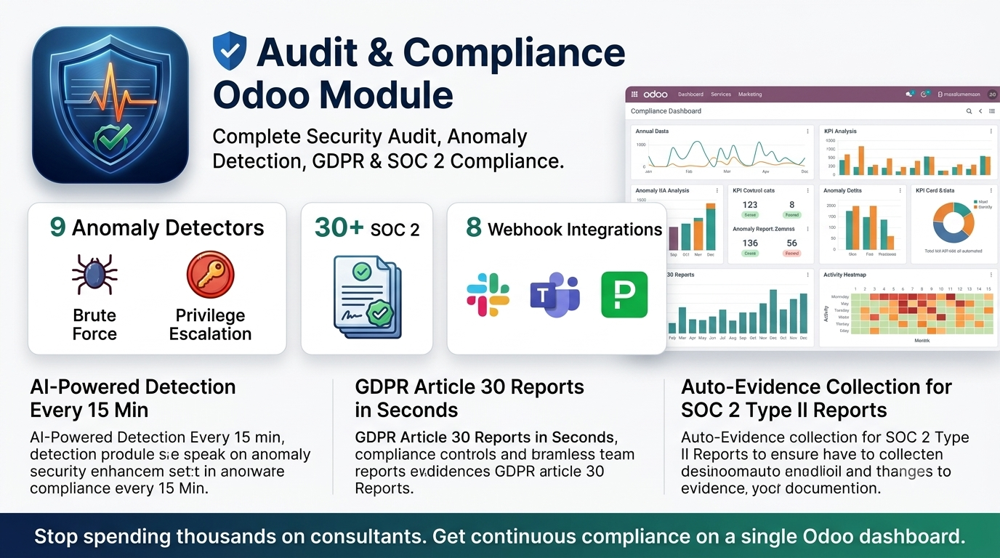

===========================================
Direct Document Scanner for Odoo 19 CE
===========================================

**Scan physical documents directly into Odoo using your locally connected
scanner hardware — no cloud, no middleware, no extra subscriptions.**

Works with HP, Canon, Epson, Brother, Xerox, Fujitsu and more.
Supports TWAIN & WIA (Windows), SANE (Linux), and eSCL (macOS).
Build multi-page PDFs directly within Odoo. 100% local processing.

----

🎬 Demo Videos
==============

- `Scanner Widget Overview <https://youtu.be/ICjm4qbfUbA>`_
- `ADF & PDF Workflow <https://youtu.be/4GZEN8-Rsfo>`_

----

✨ Key Features
==============

🔒 100% Local Processing
  Zero cloud dependency. All image processing happens client-side.
  Your documents never leave your network.

🦉 Native OWL 2 Widget
  Drop-in integration for Odoo 19 forms. No configuration needed.

✂️ Interactive Crop Editor
  8 resize handles, draggable crop box, live pixel readout for
  precise document cropping before saving.

📚 ADF Bulk-Feed Scanning
  Scan entire document stacks in one click using your scanner's
  automatic document feeder.

📑 Multi-Page PDF Assembly
  Reorder pages, re-crop, set custom filename, saved directly
  as ``ir.attachment`` inside any Odoo record.

🌐 USB · Wi-Fi · Ethernet
  Network scanners are discovered automatically. Works with
  all major connection types.

🔌 WebSocket Bridge
  Lightweight local Python bridge connects your scanner hardware
  to the Odoo web interface in real time.

----

🖥️ Supported Platforms
======================

+------------------+----------------------------+
| Platform         | Protocol                   |
+==================+============================+
| Windows 10/11    | TWAIN · WIA                |
+------------------+----------------------------+
| Linux            | SANE                       |
+------------------+----------------------------+
| macOS            | eSCL / ImageCaptureCore    |
+------------------+----------------------------+

----

📸 Screenshots
==============

.. image:: static/description/screenshot_01.png
   :alt: Scanner Widget embedded in Odoo form
   :width: 100%

.. image:: static/description/screenshot_02.png
   :alt: Crop Editor with resize handles
   :width: 100%

.. image:: static/description/screenshot_03.png
   :alt: ADF Multi-page scanning
   :width: 100%

.. image:: static/description/screenshot_04.png
   :alt: PDF Assembly panel
   :width: 100%

.. image:: static/description/screenshot_05.png
   :alt: Scanner discovery — USB and Network
   :width: 100%

.. image:: static/description/screenshot_06.png
   :alt: Saved attachment inside Odoo record
   :width: 100%

----

⚙️ Installation
===============

1. Purchase and download the module from the
   `Odoo App Store <https://apps.odoo.com>`_.
2. Download the scanner bridge binary for your platform from the
   `Releases Page <https://github.com/alzarough1106/odoo19-binaries/releases>`_.
3. Run the bridge binary on the machine connected to your scanner.
4. Install the module in Odoo via **Apps → Upload Module**.
5. Open any form view — the scanner widget will appear automatically.

----

📋 Requirements
===============

- Odoo 19.0 Community or Enterprise
- Python 3.10+
- A TWAIN / WIA / SANE / eSCL compatible scanner

----

📄 License
==========

This module is licensed under the
`Odoo Proprietary License v1.0 (OPL-1) <https://www.odoo.com/documentation/17.0/legal/licenses.html>`_.

© 2025 Al Morabet Technology. All rights reserved.

----

📬 Support
==========

For issues, questions, or feature requests please contact us via the
Odoo App Store support channel or open a ticket on GitHub.
